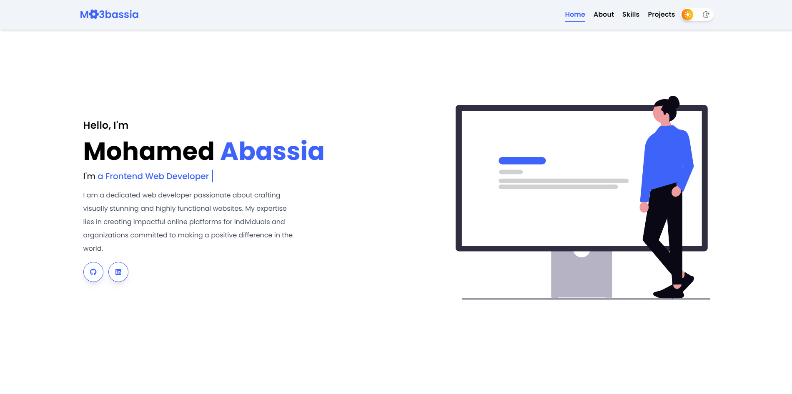

  <h1>Mohamed Abassia</h1>
  <a href="https://mo3bassia-portfolio.vercel.app/" target="_blank">https://mo3bassia-portfolio.vercel.app/</a>

<h3 align="center">Personal portfolio</h3>

## Built With

My personal portfolio <a href="https://mo3bassia-portfolio.vercel.app/" target="_blank">mo3bassia-portfolio</a> which features some of my GitHub projects as well as my resume and technical skills. 

This project was built using these technologies:

- Tailwind CSS
- HTML5
- Pure JS
- CSS3
- VsCode
- Vercel
- Font Awesome
- ScrollReveal

## Features

**🌗 Dynamic theme switch between dark and light**

**🎨 Styled with Tailwind CSS with easy-to-customize layout**

**📱 Fully Responsive**

**🚀 Version 1.0 released** - This is the first version of my portfolio, and I plan to release more versions in the future

## Currently Learning

I'm currently learning **React Js** to expand my front-end development skills.
